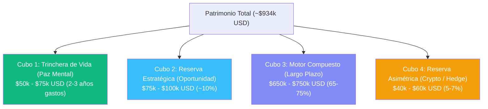

# Principios Financieros y Estrategia de Asignación de Capital

> **Propósito de este documento**: Servir como brújula estratégica, marco mental y política de inversión a largo plazo para la toma de decisiones patrimoniales. Este texto no busca predecir el futuro ni optimizar la última décima de rendimiento, sino proteger el capital acumulado, eliminar el costo de la inercia y maximizar la rentabilidad ajustada por paz mental.

---

## 1. Diagnóstico Inicial: La Paradoja del Patrimonio

Al cierre de septiembre 2026, el patrimonio neto consolidado asciende a **~$934.000 USD**.

Sin embargo, su radiografía revela una profunda asimetría estructural:

```
┌────────────────────────────────────────────────────────────────────────┐
│  DISTRIBUCIÓN DEL PATRIMONIO ACTUAL ($934.360 USD)                    │
├────────────────────────────────────────────────────────────────────────┤
│  🟣 Inversiones Productivas (Schwab, IOL, Binance):   $200.266 (21,4%) │
│  🟢 Liquidez Operativa & Bancos (BofA, Citi, Galicia): $39.794  (4,3%)  │
│  🔵 Plataformas Laborales Exterior (Deel, Payoneer):  $94.300 (10,1%) │
│  💵 Efectivo Físico Dólares (Caja de Seguridad):     $600.000 (64,2%) │
└────────────────────────────────────────────────────────────────────────┘
```

### La Paradoja
1. **Gran capacidad inversora demostrada**:
   * En Schwab: aportaste $124k y construiste un portafolio de ~$170k (+36,9% de ganancia, más de $6.500 USD en dividendos acumulados).
   * En Binance: pusiste $9.2k en 2021, lo dejaste quieto con paciencia de acero y hoy tenés ~$18.7k (+102,4% de ganancia).
   * **Conclusión**: Tu comportamiento inversor es de élite: tenés la paciencia para no vender en pánico y la humildad para no creerte más listo que el mercado.
2. **El costo silencioso de la inercia (Cash Drag)**:
   * Tener **$600.000 USD en billetes físicos** (más $94k en Deel/Payoneer) significa que el **~78% de tu patrimonio está completamente inmovilizado**.
   * Con una inflación estadounidense promedio de 3% a 3,5% anual, **$600.000 USD pierden entre $18.000 y $21.000 USD por año en poder de compra real**.
   * En 5 años quieta, esa caja de seguridad habrá evaporado silenciosamente más de **$100.000 USD** de capacidad de compra.
   * **El mayor riesgo hoy no es la volatilidad del mercado bursátil; es la certeza matemática de la pérdida de valor por inercia**.

---

## 2. Ventajas Competitivas Personales (Tu Filosofía de Inversión)

El 90% de los inversores individuales fracasa por dos razones: **sobreoperar (trading)** y **arrogancia intelectual (creer saber hacia dónde va el precio mañana)**.

Tus principios naturales ya resuelven ambos problemas:
1. **Paciencia temporal**: Entendés que el tiempo en el mercado vence al *timing* del mercado (*Time in the market > Timing the market*).
2. **Humildad epistémica**: No pretendés adivinar la próxima acción ganadora ni especular con derivados. Te apoyás en índices diversificados (ETFs globales de bajo costo) que capturan el crecimiento del capitalismo mundial.
3. **Paz mental sobre adrenalina**: Un portafolio aburrido que rinde consistentemente vale diez veces más que una posición volátil que no te deja dormir.

---

## 3. El Marco Mental de los 4 Cubos (Buckets)

Para ordenar el capital sin correr riesgos innecesarios, todo el patrimonio debe organizarse en **4 cubos con propósitos específicos e independientes**:



### Cubo 1: La Trinchera de Vida (Liquidez Inmediata)
* **Objetivo**: Garantizar que **jamás** tengas que vender una inversión en un mal momento para pagar tus gastos cotidianos.
* **Monto óptimo**: 24 a 36 meses de costo de vida (~**$50.000 a $75.000 USD**).
* **Dónde**: Cuentas bancarias a la vista (BofA, Citi, Galicia USD), billeteras (Mercado Pago, efectivo de bolsillo).
* **Regla de oro**: Este dinero no busca rendimiento; compra tranquilidad psicológica absoluta.

### Cubo 2: Reserva Estratégica y Oportunidades (Liquidez de Corto Plazo)
* **Objetivo**: Disponer de pólvora seca (*dry powder*) para aprovechar dislocaciones de mercado (crisis bursátiles, caídas del 20-30%, o compras inmobiliarias de oportunidad).
* **Monto óptimo**: 8% a 12% del patrimonio (~**$75.000 a $100.000 USD**).
* **Dónde**: Instrumentos sin riesgo de capital pero con rendimiento monetario (T-Bills a 3-6 meses, Money Market Funds en USD al 4-5% anual, saldos en Deel/Payoneer ruteados ordenadamente).
* **Regla de oro**: Se mantiene líquido o semi-líquido para actuar rápido cuando aparece una verdadera oportunidad.

### Cubo 3: El Motor Compuesto (Inversión Productiva de Largo Plazo)
* **Objetivo**: Multiplicar el poder adquisitivo real a 10, 15 y 20 años mediante activos productivos que pagan dividendos y crecen con la economía global.
* **Monto óptimo**: 65% a 75% del patrimonio (~**$600.000 a $700.000 USD** a converger progresivamente).
* **Dónde**: Portafolio en Broker de primera línea (Charles Schwab).
  * **Núcleo de Renta Variable Global (80-85% del cubo)**:
    * `SCHD` (US Dividend Equity / Value defensivo de alta calidad).
    * `SCHA` / `VTI` / `VOO` (Exposición al mercado estadounidense en su conjunto).
    * `SCHF` (Internacional desarrollado ex-US: Europa, Japón, etc., para descorrelacionar de EE.UU.).
  * **Renta Fija / Bonos de Calidad (15-20% del cubo)**:
    * `SCHZ` (US Aggregate Bond) o bonos del tesoro para amortiguar ciclos recesivos.
* **Regla de oro**: Se compra periódicamente y no se toca. Los dividendos se reinvierten sistemáticamente.

### Cubo 4: Asimetría y Cobertura Sistémica (Crypto / Convexidad)
* **Objetivo**: Cobertura frente a degradación monetaria fiat y captura de upside exponencial.
* **Monto óptimo**: 5% a 8% del patrimonio (~**$40.000 a $70.000 USD**).
* **Dónde**: Binance / Almacenamiento frío (Cold Wallet / Ledger).
  * `Bitcoin (BTC)`: 70-80% de la porción crypto (reserva de valor dura, emisión fija).
  * `Ethereum (ETH)`: 20-30% (capa de cómputo y contratos inteligentes con staking).
* **Regla de oro**: Cero trading, cero memecoins, cero yield farming especulativo. Mantener en Simple Earn Flexible o custodia propia.

---

## 4. El Gran Dilema: El Dinero Informal ("en negro") en Argentina

Tener **$600.000 USD en efectivo físico** en el sistema informal argentino es una situación muy común en el país, pero presenta desafíos específicos que hay que abordar con pragmatismo y sin ingenuidad.

### Los 3 Riesgos Reales del Efectivo en Caja de Seguridad
1. **Erosión inflacionaria mundial**: El dólar billete ya no preserva valor como en los años 90; la inflación en EE.UU. lo come a razón de 3-4% anual.
2. **Riesgo físico y de custodia**: Cajas de seguridad bancarias en Argentina tienen riesgo regulatorio implícito (posibles normativas impositivas, trabas bancarias, o en el extremo histórico, eventos sistémicos) y riesgo logístico/seguridad.
3. **Fricción de bancarización**: Cuanto mayor es el volumen, más difícil es convertirlo en activos financieros globales sin disparar alertas de origen de fondos (compliance bancario / fiscal).

### Estrategias Pragmáticas para Desplegar el Efectivo

#### Estrategia 1: El Método de "Sustitución de Flujos" (La más limpia y natural)
* **En qué consiste**: Vivir 100% del efectivo informal para todos los consumos locales posibles (supermercado, obras, refacciones, compras en comercios, viajes pagados en efectivo, autos o gastos grandes que aceptan cash).
* **El efecto multiplicador**: Al gastar el efectivo informal, **dejás de consumir tus ingresos formales del exterior** (Deel / Payoneer / BofA).
* **Resultado**: El 100% de tus honorarios nuevos del exterior queda "limpio y blanco" para ser transferido directamente a **Charles Schwab** e invertido en ETFs sin ninguna traba fiscal ni justificación sospechosa.

#### Estrategia 2: Ventanas Fiscales de Regularización (Blanqueos)
* En Argentina surgen periódicamente regímenes de blanqueo o regularización de activos (como el de la Ley 27.743 / CERA con alícuota 0% hasta $100.000 USD o más si se mantienen en el sistema financiero o se aplican a ciertos activos).
* Aprovechar estas ventanas legales para formalizar tramos de efectivo permite ingresar fondos directamente al mercado formal de capitales (CEDEARs, ONs o transferencias al exterior vía cable) con costo impositivo cero o mínimo y total tranquilidad jurídica.

#### Estrategia 3: Activos Reales Locales de Oportunidad (Real Estate)
* El mercado inmobiliario argentino es históricamente transaccionado en **efectivo billete** cara grande en escribanía.
* Si surge una oportunidad genuina de comprar un inmueble bien ubicado con descuento sustancial (donde la escritura se pacta a valores fiscales de referencia legales), es una vía tradicional para convertir cash estéril en un activo real que genera renta o apreciación sin fricción bancaria en el exterior.
* **Advertencia**: No comprar ladrillos sólo "para meter la plata". El real estate tiene iliquidez y costos de mantenimiento. Sólo comprar si el precio es una verdadera ganga.

---

## 5. Dónde SÍ Meter Plata vs. Dónde NO Meter Plata

### 🟢 DÓNDE SÍ METER PLATA (Luz Verde)
1. **ETFs de bajo costo y máxima liquidez**: VTI, VOO, SCHD, SCHF, SCHZ. Instrumentos transparentes con comisiones menores al 0,08% anual.
2. **Deuda soberana de corto plazo (US Treasuries / T-Bills)**: Rendimientos del 4-5% en USD respaldados por el gobierno de EE.UU. mientras se espera oportunidad.
3. **Bitcoin y Ethereum**: Comprados con lógica de ahorro plurianual y custodia segura.
4. **Obligaciones Negociables (ONs) de empresas exportadoras de primer nivel (en IOL)**: YPF, Pampa Energía, Telecom, Vista. Rinden 7-8% en dólares cable/MEP con respaldo operativo real (para tramos de fondos que ya estén en Argentina).
5. **Tu propia tranquilidad y salud**: Educación, herramientas de trabajo, seguridad familiar.

### 🔴 DÓNDE NO METER PLATA (Luz Roja Absoluta)
1. **Trading activo, futuros o apalancamiento**: La vía más rápida para convertir $100.000 USD en cero.
2. **Plataformas que prometen rendimientos milagrosos en USD (>8-10% sin riesgo)**: Celsius, BlockFi y FTX demostraron que si no sabés de dónde viene el rendimiento, el rendimiento sos vos.
3. **Fondos Comunes de Inversión tradicionales bancarios con comisiones altas**: Suelen cobrar 2-3% de administración y rendir menos que el índice de referencia.
4. **Préstamos a amigos o familiares**: La forma más segura de perder la plata y la relación.
5. **Altcoins o tokens de moda**: Si no sobrevivieron al menos dos ciclos alcistas y bajistas completos (como BTC y ETH), no son aptos para un patrimonio serio.
6. **Negocios ilíquidos que no entendés ni controlás**: Franquicias o emprendimientos ajenos donde te invitan como "socio capitalista".

---

## 6. Plan de Acción y Ritmo de Transición

No se debe intentar pasar de $200k a $700k invertidos de un día para el otro. El apuro engendra errores operativos y estrés innecesario.

### La Regla del "Dollar-Cost Averaging" (DCA)
* Asignar un monto fijo mensual o trimestral para fondear el portafolio bursátil (ej. $10.000 a $20.000 USD por mes desde las cuentas que tienen liquidez formal, como Deel o Payoneer).
* Comprar en días fijos sin importar si las noticias dicen que el mercado está en máximos o en crisis. A 10 años, el costo promedio siempre favorece al inversor sistemático.

### Rutas Operativas Concretas
1. **Ruta Deel / Payoneer ➔ Schwab**:
   * Desinflar los saldos ociosos en Deel ($56.9k) y Payoneer ($37.4k). Dejar solo lo operativo (ej. $10k-$15k entre ambas) y transferir el excedente a cuenta bancaria en EE.UU. (BofA) y de ahí a Charles Schwab.
   * Esto inyecta de inmediato **~$75.000 USD de capital nuevo al Cubo 3** sin tocar un solo dólar del efectivo local.
2. **Ruta del Efectivo Local**:
   * Mantener el efectivo en caja de seguridad como reserva estratégica pesada por el momento.
   * Adoptar la Estrategia de Sustitución: pagar todo gasto local con ese efectivo para permitir que todo nuevo ingreso formal viaje directamente a inversión.
   * Si se presenta un régimen de regularización (blanqueo) o una compra inmobiliaria irrepetible, utilizar un tramo de ese efectivo de forma ordenada.

---

## 7. Resumen de Mandamientos

1. **La inercia es cara**: El dinero parado en billetes no es seguro; se derrite día a día por inflación.
2. **La paciencia es tu mayor activo**: Comprá activos que quieras tener por los próximos 15 años y dejá que el interés compuesto haga el trabajo pesado.
3. **Separar trinchera de inversión**: Con 2 años de vida asegurados en el Cubo 1, las fluctuaciones de Wall Street son solo ruido de fondo.
4. **No mezclar circuitos sin asesoramiento**: Mantener la prolijidad entre los flujos limpios que fondean brokers internacionales y el efectivo físico local.
5. **Simplicidad vence a sofisticación**: 4 ETFs diversificados y Bitcoin superan al 95% de los fondos de inversión de Wall Street en cualquier década.
